# Patch-Craft Self-Supervised Training (PCST) 

[Arxiv](https://arxiv.org/abs/2211.09919) | [CVF (pdf)](https://openaccess.thecvf.com/content/CVPR2023/papers/Vaksman_Patch-Craft_Self-Supervised_Training_for_Correlated_Image_Denoising_CVPR_2023_paper.pdf) | [CVF (suppl)](https://openaccess.thecvf.com/content/CVPR2023/supplemental/Vaksman_Patch-Craft_Self-Supervised_Training_CVPR_2023_supplemental.pdf) | [GitHub](https://github.com/grishavak/pcst) | [Presentation](https://youtu.be/UDg-VG5VTc4)

# Questions and Answers

### Q1: What is the focus of this project?
Patch-Craft Self-Supervised Training (PCST) proposes a novel self-supervised training technique for removing unknown correlated noise. This technique does not require knowledge of the noise model nor access to ground truth targets.

### Q2: What is image denoising?
Image denoising is the process of rectifying measurement errors originating from sensors. These errors, commonly referred to as noise, often appear as random colorful dots. Such dots prove quite bothersome, particularly when capturing images under low-light conditions. The primary role of an image denoiser is to eradicate this noise while preserving the integrity of image details. Contemporary consumer cameras typically incorporate an image-denoising algorithm within their processing pipeline. Image denoisers vary in their capability to accurately reconstruct images. The most advanced and precise denoising methods usually leverage deep learning techniques&nbsp;[[1]](https://arxiv.org/pdf/2301.03362.pdf).

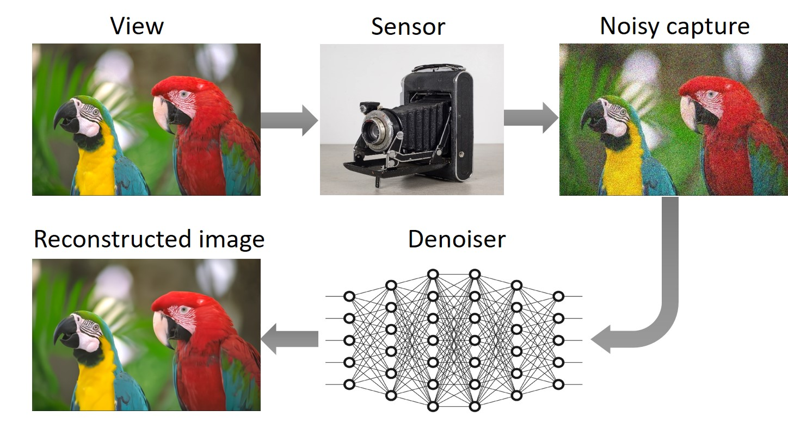

### Q3: How are deep-learning denoisers typically trained?
Deep-learning denoisers are commonly trained in a *supervised* manner using a dataset comprising pairs of clean and noisy images. The noisy images are generated by contaminating the clean images with synthetic noise sampled from a predefined noise distribution. The most common selection for noise distribution is the independent and identically distributed (i.i.d.) Gaussian. 

During training, the noisy images are fed into the network's input, while their corresponding clean counterparts serve as the target outputs. The training loss function penalizes discrepancies between the network's predictions and the designated targets, thus incentivizing the network to produce outcomes that closely resemble the clean images.

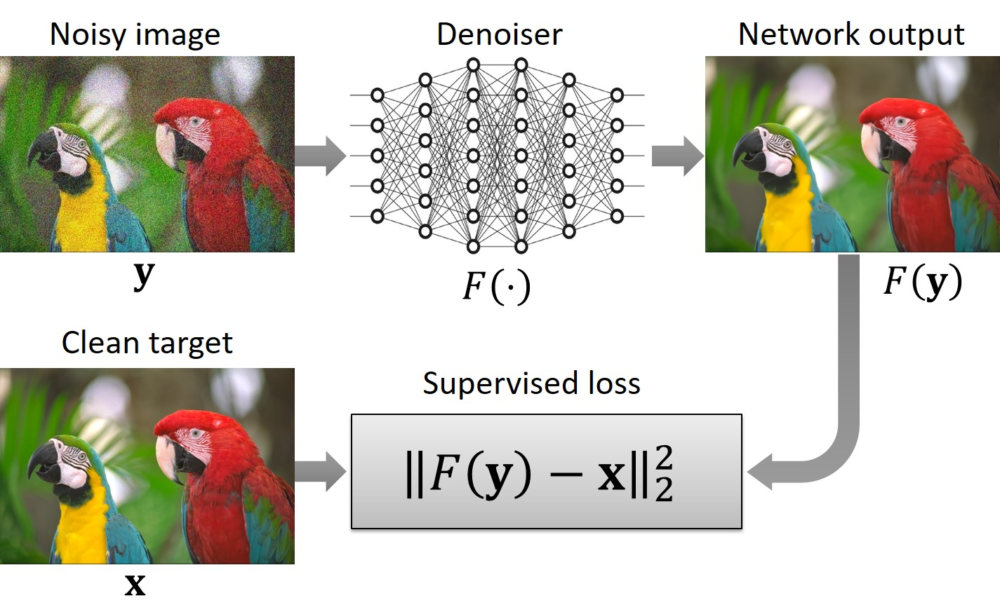

### Q4: What is the concept of self-supervised training, and where can it be applied?
In the context of image denoising, *self-supervised* training entails training without the use of clean targets, meaning that the network is exclusively trained using noisy images. This approach proves valuable in scenarios where the noise model is unknown, yet access to noisy images is available. Consider, for instance, a real-world noise image denoising task. This task involves removing noise that originates from a particular sensor whose model is unknown, and its distribution may vary with sensor parameters such as ISO, aperture size, exposure time, etc. 

Estimating a noise model or acquiring clean images can be challenging. However, capturing noisy images using the sensor itself is relatively straightforward. Hence, self-supervised training can offer a practical and efficient solution for real image denoising tasks, as it circumvents the requirement for knowledge of the noise model or access to clean images.

### Q5: The blind denoising approach enables training of networks to handle i.i.d. Gaussian noise across a range of &sigma; (intensity) values. Could this approach also be applied to address unknown noise distributions?  

Networks trained using this approach exhibit good performance when applied to i.i.d. Gaussian noise with unknown &sigma;. However, their performance may degrade when confronted with other noise types, such as correlated (colored) noise. To illustrate this point, we conducted the following experiment: We applied bias-free&nbsp;[[2]](https://arxiv.org/pdf/1906.05478.pdf) DnCNN&nbsp;[[3]](https://arxiv.org/pdf/1608.03981.pdf) architecture trained for 0&nbsp;&le;&nbsp;&sigma;&nbsp;&le;&nbsp;102 on two distinct noise types &mdash; i.i.d. Gaussian with &sigma;&nbsp;=&nbsp;50, and spatially correlated Gaussian with &sigma;&nbsp;=&nbsp;50. The spatially correlated noise is constructed by convolving i.i.d. Gaussian noise with a 2&nbsp;&times;&nbsp;2 rectangular kernel (with appropriate normalization). 

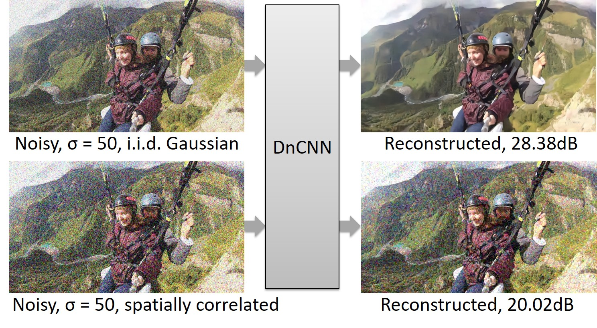

As depicted, the network produces a visually pleasing reconstruction for i.i.d. noise. However, for correlated noise, the reconstructed outcome falls short of expectations.

### Q6: Do you make any assumptions regarding the noise?
Yes, we assume that the contaminating noise is additive, zero mean, but not necessarily Gaussian, and it could be cross-channel and spatially correlated. An additional assumption is that the noise is (mostly) independent of the image and nearly homogeneous, i.e., having low to moderate spatially variant statistics. Examples of such noise could be Gaussian correlated noise or real image noise in digital cameras.

### Q7: What does your self-supervised loss look like?
It closely resembles the supervised loss mentioned earlier, with one key difference: we utilize noisy images as targets rather than clean images. As a result, the loss function penalizes disparities between the network's prediction and noisy targets.

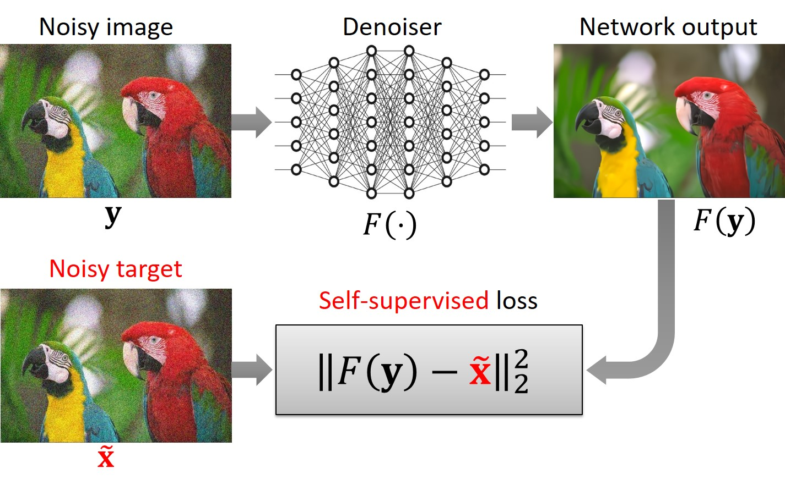

### Q8: By penalizing disparities between the network prediction and noisy targets, the self-supervised loss function guides the network to generate noisy outputs. Paradoxically, even though the loss function encourages noisy outputs, the network learns to produce clean reconstruction. Can you please elaborate on this point for further clarity?

In order to explain this topic we need introduce some notations. Let us denote by **z** input noise, and by **w** target noise.   

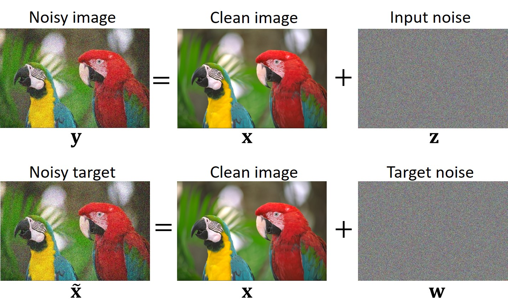

From *Lemma&nbsp;1* in our paper&nbsp;[[4]](https://arxiv.org/pdf/2211.09919.pdf) follows that if **x**, **z**, and **w** are mutually statistically independent, and **w** admits a zero mean (*E*[**w**]&nbsp;=&nbsp;**0**), then the network learns to produce clean reconstructions.

It is important to emphasize that if the independence condition is not met, the network might not learn to produce clean reconstructions. For example, if **w** and **z** are identical (**w**&nbsp;=&nbsp;**z**), the network would learn the trivial identity operation (*F*(__y__)&nbsp;=&nbsp;__y__).

### Q9: What type of data is utilized for training?
For training, we utilize short video sequences or bursts of images consisting of *M* frames, with *M* being set to 7 in our experimental setup. These sequences can be captured using the burst mode feature in digital cameras or by recording short videos. Notably, our method does not necessitate image registration within the burst. However, it is advisable to steer clear of bursts that encompass abrupt camera or object movements, as well as those containing lighting fluctuations.

### Q10: How is an input/target image pair constructed from a noisy sequence?
We begin with a sequence comprising *M* images, denoted as {**y***1*,&nbsp;...,&nbsp;**y***M*}, (where *M* is an even number). For the sake of clarity, let us designate the middle frame as **y***i* (where *M*&nbsp;=&nbsp;2*i*&nbsp;+&nbsp;1). This frame functions as the input for the network, while the remaining *M*&nbsp;-&nbsp;*1* frames, {**y***1*,&nbsp;...,&nbsp;**y***M*}\\**y***i*, are harnessed to form a noisy target.

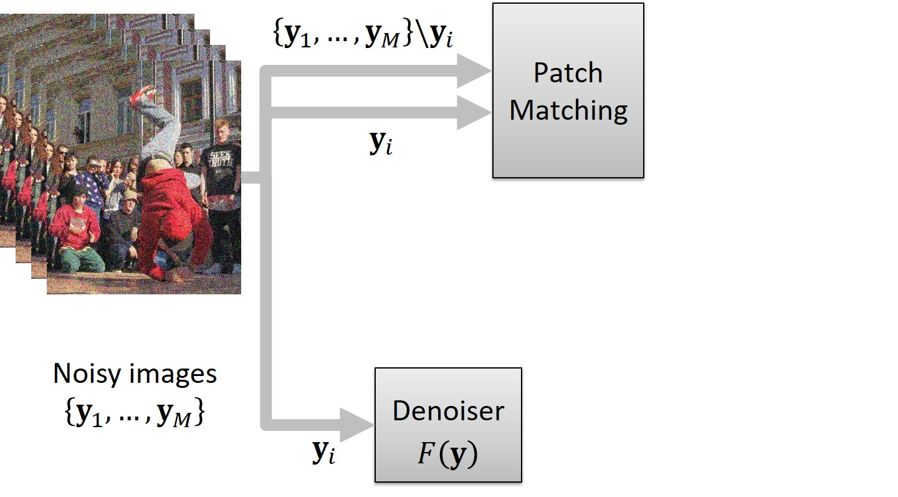

The creation of the target involves the Patch Matching block, which operates as follows: It splits the middle frame **y***i* into patches of size p&nbsp;&times;&nbsp;p.

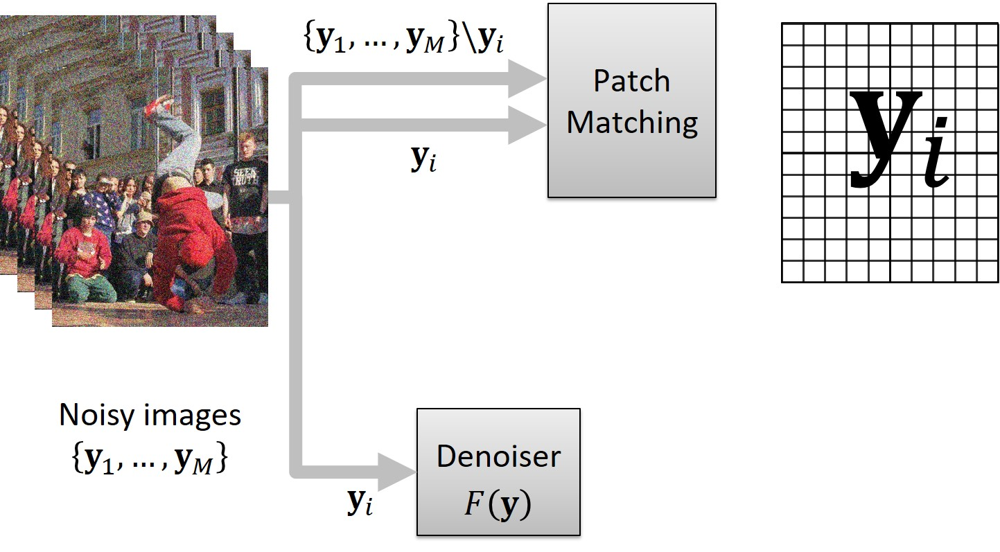

For each patch, the block finds its nearest neighbor (in terms of *L*2 norm) within a bounding box of size *B*&nbsp;&times;&nbsp;*B*, centered at the location of the patch within the remaining frames, {**y***1*,&nbsp;...,&nbsp;**y***M*}\\**y***i*. Then, each patch of **y***i* is replaced with its corresponding nearest neighbor. This patch-replacing process, akin to motion compensation in concept, gives rise to an artificially assembled *patch-craft* image. This patch-craft image is then used as a noisy target for training.

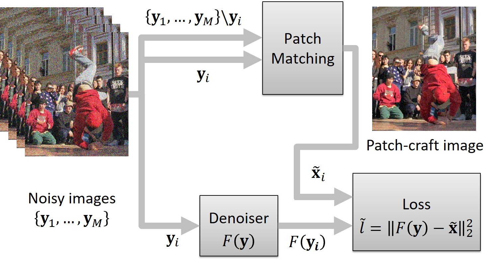

### Q11: Considering that artificial patch-craft images are formed by assembling patches extracted from various locations across distinct frames, the question arises: could these synthetic images potentially suffer from blockiness?

Indeed, patch-craft images can exhibit blockiness. To address this concern, we adopt a strategy of creating *p*2 distinct patch-craft images for each input image. Let us delve into the construction process, followed by an explanation of how this approach mitigates the blockiness issue. The illustration below provides a schematic depiction of the **y***i* frame, partitioned into patches of size *p*&times;*p*. To ensure an integer number of patches in each dimension, the frame undergoes an extension through mirror reflection. The marked dashed region denotes this extrapolation. After the patch replacement procedure, the extrapolation is cropped.

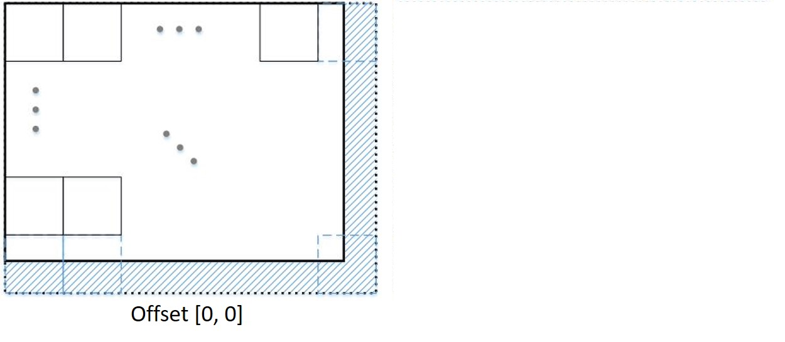

We term this patch division a "zero offset division" as there is no displacement between the top-left patch and the frame's top-left corner &mdash; the patch and the corner align perfectly. However, this is not the sole method of partitioning the frame. An alternative approach involves introducing an offset of \[*k*,&nbsp;*l*\] pixels between the corner and the patch, as portrayed in the subsequent figure. When patches from this partitioning are replaced with their nearest neighbors, a distinct patch-craft frame emerges.

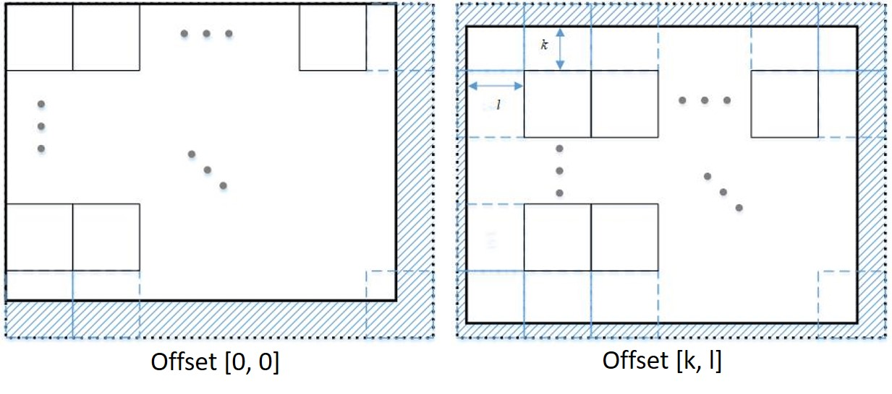

Given that *k*&nbsp;=&nbsp;0,&nbsp;1,&nbsp;...,&nbsp;*p*&nbsp;-&nbsp;1 and *l*&nbsp;=&nbsp;0,&nbsp;1,&nbsp;...,&nbsp;*p*&nbsp;-&nbsp;1 for patches of size *p*&nbsp;&times;&nbsp;*p*, there exist *p*2 different splits. Each offset gives rise to a distinct patch-craft image. Since these images possess block boundaries in different locations, averaging the *p*2 patch-craft images could alleviate blockiness. However, this averaging might lead to blurring. To circumvent potential blurring, we opt not to average the patch-craft images. Instead, during the training process, we randomly select one of the *p*2 patch-craft images as the target.

It is important to note that since the neighbor patches originate from different locations, all *p*2 patch-craft images constructed from the same sequence of frames exhibit similarity but are not identical. Each image contributes supplementary information, thereby augmenting and enriching the training dataset.

### Q12: Building patch-craft images relies on patch matching. However, what if the patch matching process fails to find a nearest neighbor that exhibits sufficient similarity? Additionally, are **x**, **z**, and **w** mutually statistically independent in your scenario? If not, you cannot use *Lemma&nbsp;1* to conclude that the network learns to reproduce clean images. 

Certainly, patch matching can encounter difficulties in retrieving a similar nearest neighbor due to the possibility that such a nearest neighbor might not actually exist. Examples of dissimilar nearest neighbors can be observed in the subsequent figure, particularly around the breakdancer's leg.  

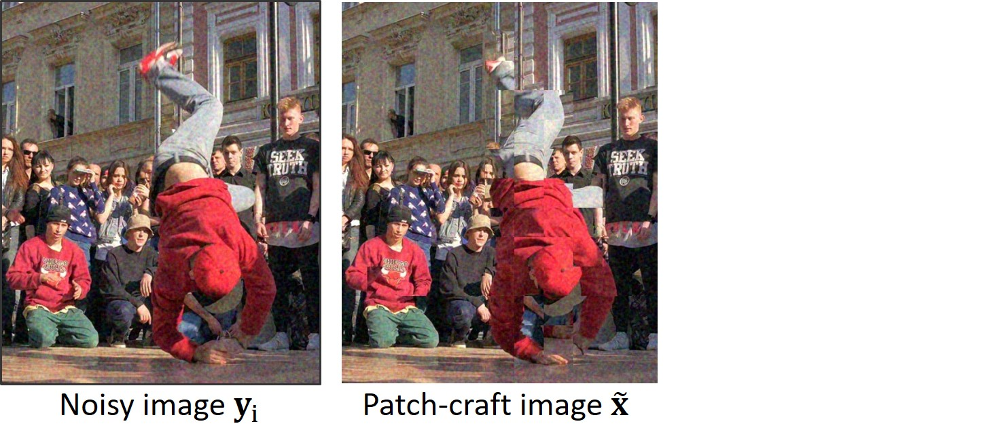

As shown in *Appendix B.2* of our paper&nbsp;[[4]](https://arxiv.org/pdf/2211.09919.pdf) (equations 11-13), such discrepancies between the corresponding patches of the input and target images result in a negative correlation between **x** and **w**, expressed as *&sigma;**x*,*w*&nbsp;&lt;&nbsp;0. This correlation can be visually observed in the following figure.

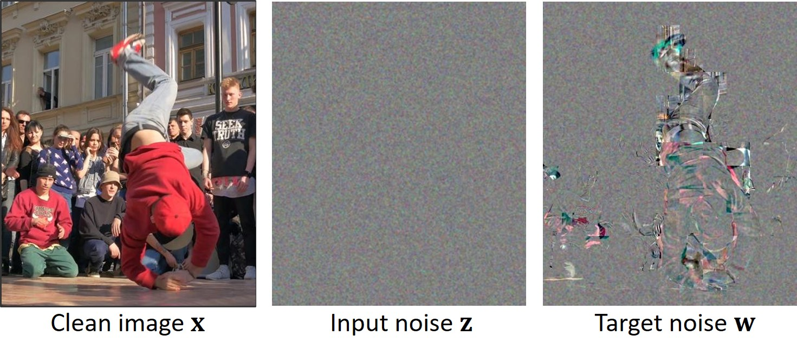

Consequently, this implies that the independence required for utilizing *Lemma&nbsp;1* does not hold in dissimilar areas. To address this problem, we filter out from the training set target images that exhibit discrepancies with the corresponding input images. To explain the filtering process, we need to introduce additional notations. We denote by **r** the difference between the input and target images

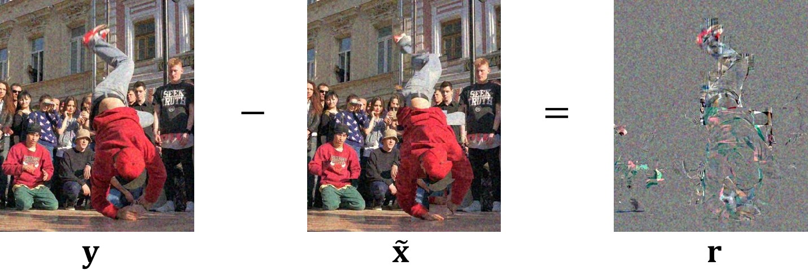

and denote by *s**y*,*r* the empirical covariance (scalar) between **y** and **r**,

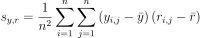

where

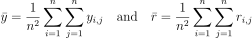

are pixel means of **y** and **r**, respectively.

Given a target image, **r** and *s**y*,*r* can be easily calculated. We are going to use the *s**y*,*r* for filtering the training set from dissimilar targets. First, we calculate corresponding *s**y*,*r* values for all target images in the training set and plot their histogram.

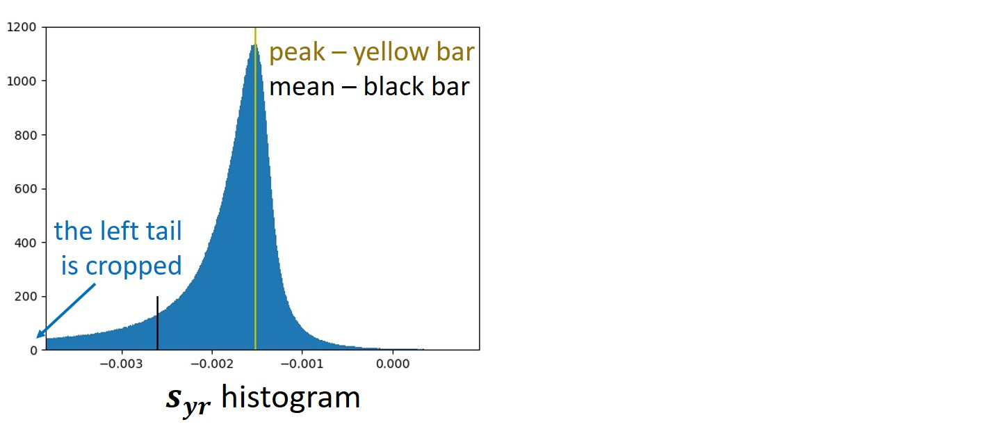

According to *Proposition&nbsp;6* in our paper&nbsp;[[4]](https://arxiv.org/pdf/2211.09919.pdf), if **x**, **z**, and **w** are mutually statistically independent, then *s**y*,*r* should follow a Gaussian distribution. However, as evident from the above figure, the actual histogram of *s**y*,*r* does not exhibit a Gaussian shape. The histogram is also noticeably asymmetric, featuring a pronounced left tail. The asymmetry of the histogram causes its mean to be positioned significantly to the left of the peak. In the specific example illustrated in the figure, the mean is so far to the left that it could be mistaken for an error. This distortion occurs because the left tail extends much more than what is visible in the figure; we truncated it to enhance clarity.

Furthermore, *Proposition&nbsp;8* in our paper&nbsp;[[4]](https://arxiv.org/pdf/2211.09919.pdf) indicates that a lack of similarity between input and target images leads to strongly negative *s**y*,*r* values, accounting for the presence of the histogram tail. To address this, we apply a filtering process to the training dataset by cropping the tail of the histogram. The filtering involves straightforward thresholding, wherein we exclude all target images from the training dataset with *s**y*,*r* below a certain threshold denoted as *s**min*. The threshold, *s**min*, is determined such that, after filtering, the histogram is centered, ensuring perfect alignment between the mean and the peak.

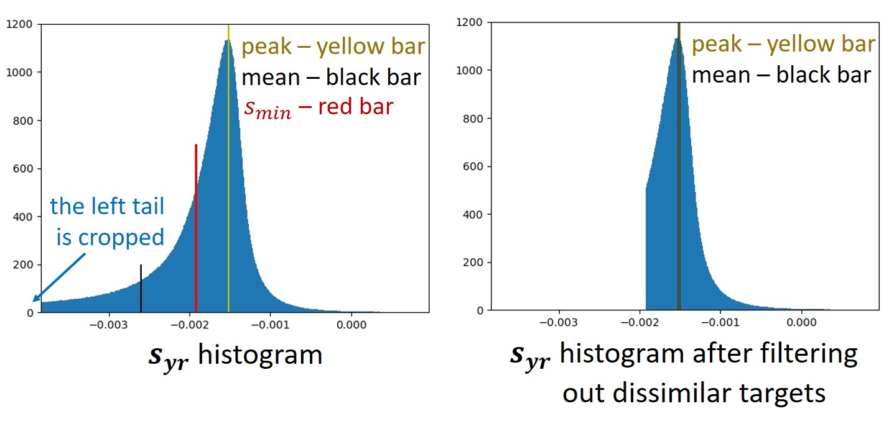

It is worth noting that this filtering enhances training stability and considerably boosts the denoising performance, as illustrated in the PSNR vs. epoch graph below.

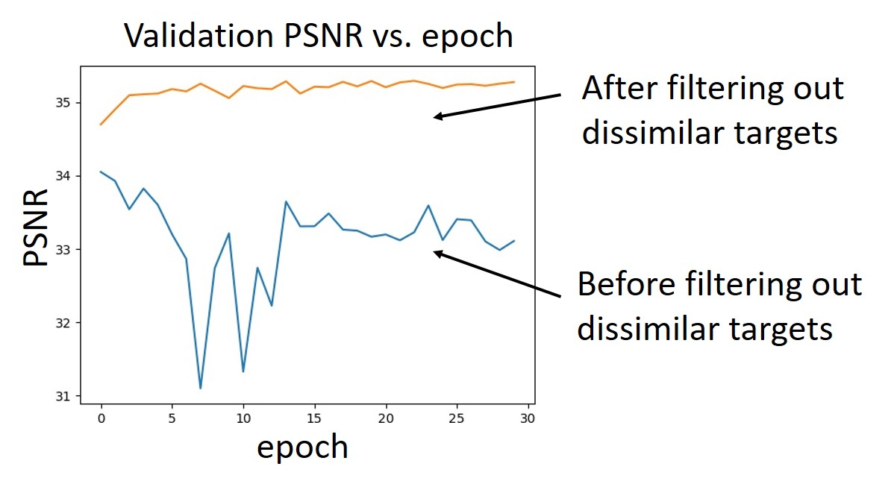

### Q13: Do you train networks from scratch?
No, we train networks in an adaptation manner, beginning with networks pre-trained for blind i.i.d. Gaussian denoising task, and retraining them using the proposed patch-craft method

### Q14: Does the patch-craft method assume that noise is temporally independent, meaning that the noise in frame *k* is statistically independent of the noise in frames *k&nbsp;-&nbsp;1* and *k&nbsp;+&nbsp;1*? What if the noise in my video sequences exhibits temporal correlations?

Yes, the patch-craft training method assumes temporal independence of noise. If this assumption does not hold, it might be worth introducing temporal sampling. For example, instead of using *m* consecutive frames, you could opt for frames numbered as *0, 5, 10, ..., 5m - 10, 5m - 5*. This approach might help mitigate temporal correlations.

[//]: # (latex: https://latex.codecogs.com) 

# Results
- B-UNet and B-DnCNN refer to the UNet and DnCNN architectures pre-trained for blind i.i.d. Gaussian denoising. 
- PC-UNet and PC-DnCNN refer to the UNet and DnCNN architectures trained using the patch-craft self-supervised training method.

## Example of denoising with correlated Gaussian noise. 

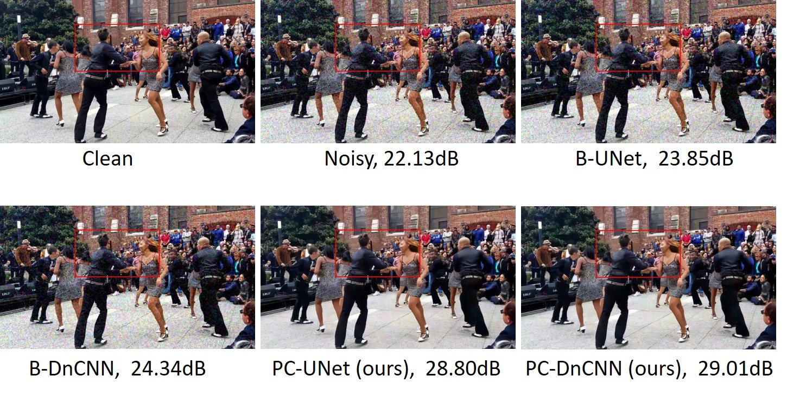

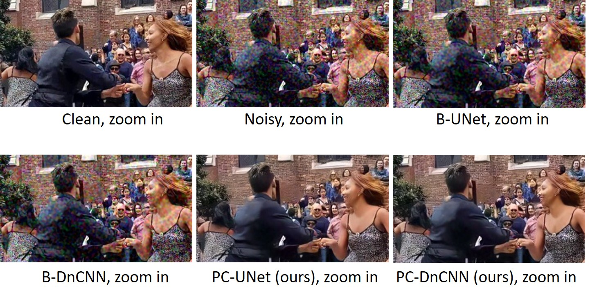

## Example of denoising with real-world noise. 

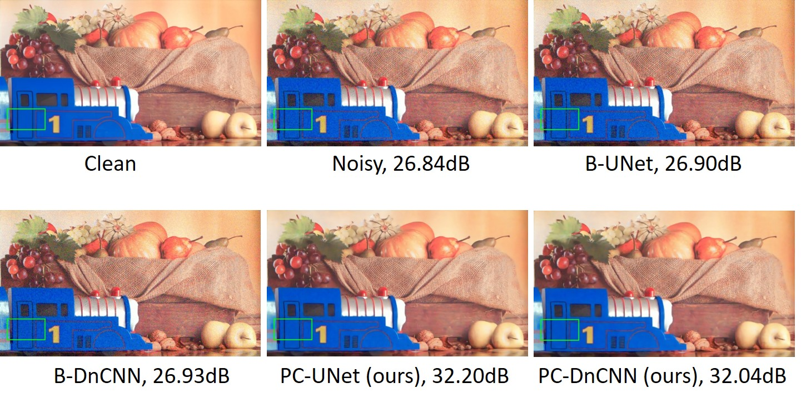

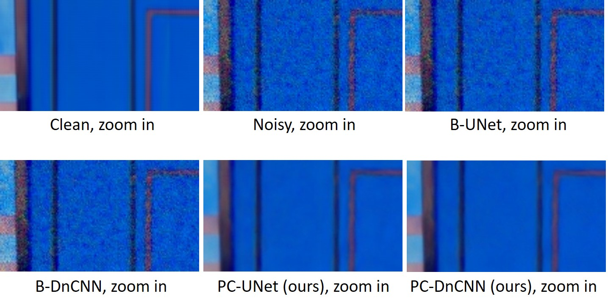

### References
[[1] Elad, Michael, Bahjat Kawar, and Gregory Vaksman. "Image Denoising: The Deep Learning Revolution and Beyond--A Survey Paper--." arXiv preprint arXiv:2301.03362 (2023).](https://arxiv.org/pdf/2301.03362.pdf)

[[2] Mohan, Sreyas, et al. "Robust and interpretable blind image denoising via bias-free convolutional neural networks." arXiv preprint arXiv:1906.05478 (2019).](https://arxiv.org/pdf/1906.05478.pdf)

[[3] Zhang, Kai, et al. "Beyond a gaussian denoiser: Residual learning of deep cnn for image denoising." IEEE transactions on image processing 26.7 (2017): 3142-3155.](https://arxiv.org/pdf/1608.03981.pdf)

[[4] Vaksman, Gregory, and Michael Elad. "Patch-Craft Self-Supervised Training for Correlated Image Denoising." Proceedings of the IEEE/CVF Conference on Computer Vision and Pattern Recognition. 2023.](https://arxiv.org/pdf/2211.09919.pdf)
